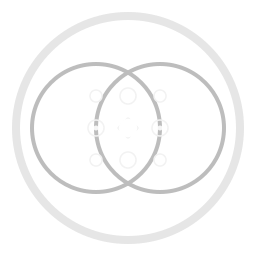

# Phenomenological Rendezvous

[](https://crates.io/crates/phenomenological-rendezvous)
[](https://docs.rs/phenomenological-rendezvous)


<p align="center">
  <a href="https://github.com/infinityabundance/phenomenological-rendezvous">
    
  </a>
</p>

Phenomenological Rendezvous is a serverless peer coordination protocol that relies on matched internal representational patterns rather than centralized infrastructure. This repository provides a Rust reference implementation of the protocol-level building blocks.

The crate focuses on SRTs, pattern space definitions, matching logic, and simulation tooling. It does not include biosensor drivers, device firmware, or mobile applications. The paper is available at DOI: 10.5281/zenodo.18558066 (link: `https://doi.org/10.5281/zenodo.18558066`). GitHub: `https://github.com/infinityabundance/phenomenological-rendezvous`.

## Installation
```toml
[dependencies]
phenomenological-rendezvous = "0.1"
```

```bash
cargo add phenomenological-rendezvous
```

## Basic Usage
```rust
use phenomenological_rendezvous::{
    SemanticRendezvousToken,
    SubmodalityPattern,
};
use phenomenological_rendezvous::srt as pattern;
use phenomenological_rendezvous::matching::{MatchingConfig, Matcher};

fn main() {
    let srt_hex = "000102030405060708090a0b0c0d0e0f101112131415161718191a1b1c1d1e1f";
    let srt = SemanticRendezvousToken::from_hex(srt_hex).unwrap();
    let target = pattern::pattern_from_srt(&srt, b"example-salt");

    let measured = SubmodalityPattern::zeros();
    let config = MatchingConfig::new(0.5, 3);
    let mut matcher = Matcher::new(config);
    let matched = matcher.observe(&measured, &target);
    println!("Matched? {}", matched);
}
```

## Features
- SRT encoding primitives
- Submodality pattern data structures
- Matching and rendezvous utilities
- Simulation scaffolding for experiments

## Conceptual Overview
Semantic Rendezvous Tokens (SRTs) are shared secrets used to derive target patterns deterministically. Given an SRT and a salt (oracle-state), both peers compute the same target pattern without revealing the secret itself.

Submodality patterns represent internal sensory and affective dimensions across nine axes (e.g., brightness, tempo, arousal). These axes are normalized so distances can be measured consistently even when raw values are in different units.

Matching compares a measured pattern against a target in normalized space. A match requires the distance to fall below a threshold `epsilon`, and a temporal window (`window_size`) enforces stability across consecutive observations.

This crate does not implement sensor drivers, device firmware, mobile apps, or user experience layers. It focuses on protocol logic and reference tooling only.

## Encoding
An SRT plus oracle-state (salt) deterministically maps to a SubmodalityPattern using HMAC-SHA256. The hash is partitioned into 16-bit segments and each segment is quantized into the appropriate range for its dimension. This yields a stable, reproducible pattern without exposing the secret.

## Status
Status: Experimental reference implementation of the Phenomenological Rendezvous protocol. APIs may change.

## Command-line Usage
Derive a target pattern from an SRT and salt:

```bash
cargo run --bin phenorv -- encode-target \\
  --srt-hex 0000000000000000000000000000000000000000000000000000000000000000 \\
  --salt-string \"oracle-state\" \\
  --output target.json
```

Match a JSONL stream of measured patterns:

```bash
cargo run --bin phenorv -- match-stream \\
  --srt-hex 0000000000000000000000000000000000000000000000000000000000000000 \\
  --salt-string \"oracle-state\" \\
  --epsilon 0.1 \\
  --window-size 3 \\
  --input examples/measured_example.jsonl
```

## Running Tests and Examples
```bash
cargo test
```

```bash
cargo run --example demo_offline_matching
```

```bash
cargo run --example demo_simulation
```

## Contributing
Issues and pull requests are welcome. Please keep new work aligned with the protocol as described in the paper and avoid introducing incompatible semantics without discussion. The API is experimental and may change.

## License
Apache-2.0
